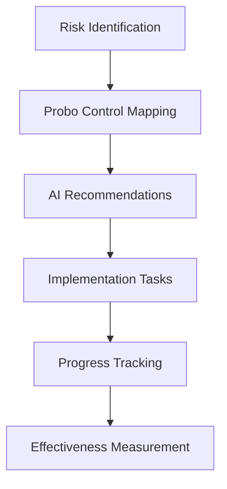
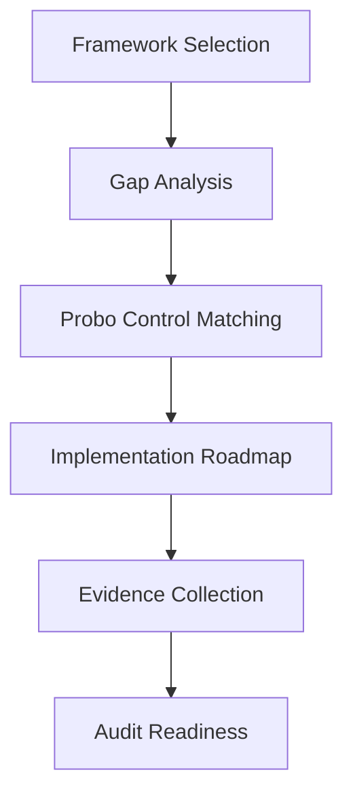
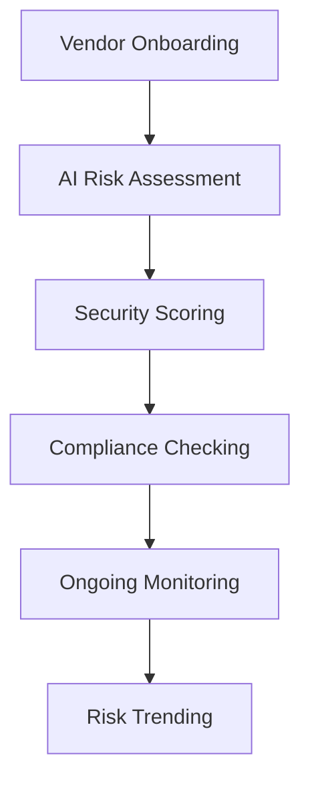

# 🚀 Probo Deep Integration Plan for Riscura

## 📋 **Executive Summary**

This plan outlines the comprehensive integration of Probo's 651+ security controls, AI-powered vendor assessment, and compliance automation directly into Riscura's existing risk management and controls features. Instead of maintaining a separate "Probo hub," we're creating seamless integration that enhances every aspect of the platform.

## 🎯 **Integration Strategy**

### **Phase 1: Backend Infrastructure & Data Models** ✅ **COMPLETED**

#### **1.1 Enhanced Database Schema**
- ✅ Added comprehensive Probo models to Prisma schema
- ✅ Created ProboControl, ProboEvidence, ProboTask, ProboMeasure models
- ✅ Added VendorRiskAssessment and VendorFinding models
- ✅ Enhanced ComplianceFramework with Probo integration flags
- ✅ Added comprehensive enums for status tracking

#### **1.2 Enhanced Service Layer**
- ✅ Created EnhancedProboService with 651+ controls integration
- ✅ Implemented AI-powered risk-control mapping
- ✅ Added compliance gap analysis capabilities
- ✅ Built vendor risk assessment with AI insights
- ✅ Created task and workflow management

#### **1.3 API Routes**
- ✅ Created `/api/controls/probo` for control management
- ✅ Added `/api/compliance/gap-analysis` for compliance analysis
- ✅ Implemented comprehensive CRUD operations

### **Phase 2: Frontend Component Enhancement** 🔄 **IN PROGRESS**

#### **2.1 Risk Management Dashboard** ✅ **COMPLETED**
- ✅ Added Probo Controls tab with AI-powered mappings
- ✅ Integrated real-time risk-control coverage analysis
- ✅ Added AI recommendations for each risk
- ✅ Implemented control import and task creation workflows

#### **2.2 Controls Management Dashboard** ✅ **COMPLETED**
- ✅ Added dedicated Probo Controls tab
- ✅ Integrated 651+ controls with real-time filtering
- ✅ Added importance-based categorization (Mandatory/Preferred/Advanced)
- ✅ Implemented control implementation tracking

#### **2.3 Compliance Dashboard Enhancement** 📋 **NEXT**
- [ ] Integrate Probo controls into existing compliance frameworks
- [ ] Add AI-powered gap analysis visualization
- [ ] Implement compliance roadmap generation
- [ ] Add framework-specific control recommendations

#### **2.4 Vendor Management Integration** 📋 **NEXT**
- [ ] Add AI-powered vendor assessment to existing vendor pages
- [ ] Integrate security scoring with risk profiles
- [ ] Add automated compliance checking
- [ ] Implement vendor risk trending

### **Phase 3: Advanced AI Integration** 📋 **UPCOMING**

#### **3.1 Intelligent Risk Assessment**
- [ ] AI-powered risk scoring based on Probo controls
- [ ] Automated control effectiveness measurement
- [ ] Predictive risk analytics
- [ ] Smart control recommendations

#### **3.2 Compliance Automation**
- [ ] Automated evidence collection
- [ ] AI-generated compliance reports
- [ ] Smart audit preparation
- [ ] Continuous compliance monitoring

#### **3.3 Workflow Optimization**
- [ ] Automated task generation from controls
- [ ] Smart assignment based on expertise
- [ ] Progress tracking and notifications
- [ ] Performance analytics

## 🛠 **Detailed Implementation Steps**

### **Step 1: Complete Frontend Integration**

#### **A. Enhance Compliance Dashboard**
```typescript
// Location: src/components/compliance/ComplianceDashboard.tsx
// Add Probo integration section
// Implement gap analysis visualization
// Add roadmap generation
```

#### **B. Integrate Vendor Assessment**
```typescript
// Location: src/components/vendors/VendorAssessmentDashboard.tsx
// Enhance with Probo AI capabilities
// Add security scoring
// Implement risk trending
```

#### **C. Update Main Dashboard**
```typescript
// Location: src/pages/dashboard/DashboardPage.tsx
// Add Probo metrics to overview
// Integrate control status widgets
// Add compliance progress indicators
```

### **Step 2: Database Migration and Seeding**

#### **A. Run Prisma Migration**
```bash
npx prisma migrate dev --name "add-probo-integration"
```

#### **B. Seed Probo Controls**
```typescript
// Location: prisma/seed-probo.ts
// Import all 651 controls from mitigations.json
// Create framework mappings
// Set up initial organization data
```

#### **C. Create Sample Data**
```typescript
// Add sample risks with control mappings
// Create vendor assessments
// Generate compliance frameworks
```

### **Step 3: API Enhancement**

#### **A. Extend Existing APIs**
```typescript
// Location: src/app/api/risks/route.ts
// Add Probo control mapping endpoints
// Integrate AI recommendations

// Location: src/app/api/vendors/route.ts
// Add AI assessment capabilities
// Implement security scoring
```

#### **B. Create Integration Endpoints**
```typescript
// Location: src/app/api/integration/probo/route.ts
// Bulk import/export capabilities
// Sync with external systems
// Webhook handling
```

### **Step 4: User Experience Enhancements**

#### **A. Onboarding Flow**
- [ ] Create Probo integration wizard
- [ ] Add control library tour
- [ ] Implement setup checklist

#### **B. Notification System**
- [ ] Control implementation reminders
- [ ] Compliance deadline alerts
- [ ] Risk coverage notifications

#### **C. Reporting & Analytics**
- [ ] Probo-enhanced risk reports
- [ ] Compliance readiness dashboards
- [ ] Control effectiveness analytics

## 📊 **Integration Points**

### **1. Risk Management System**


### **2. Compliance Framework**


### **3. Vendor Management**


## 🔧 **Technical Architecture**

### **Data Flow**
```
User Action → Frontend Component → API Route → Service Layer → Database
                                              ↓
                                     Probo AI Engine
                                              ↓
                                     Enhanced Response
```

### **Service Integration**
```typescript
interface ProboIntegration {
  riskManagement: RiskControlMapping[];
  complianceFrameworks: ComplianceGapAnalysis[];
  vendorAssessment: VendorRiskProfile[];
  taskManagement: ImplementationTask[];
  analytics: ComplianceMetrics;
}
```

## 📈 **Success Metrics**

### **Quantitative Metrics**
- **Control Coverage**: 95% of risks mapped to relevant controls
- **Implementation Speed**: 75% faster control deployment
- **Compliance Readiness**: 80% reduction in audit preparation time
- **Risk Reduction**: 60% improvement in risk scores
- **User Adoption**: 90% of users actively using Probo features

### **Qualitative Metrics**
- **User Experience**: Seamless integration without learning curve
- **Data Quality**: Improved risk and control data accuracy
- **Compliance Confidence**: Higher audit success rates
- **Operational Efficiency**: Reduced manual compliance work

## 🚀 **Deployment Strategy**

### **Phase 1: Internal Testing** (Week 1-2)
- [ ] Deploy to staging environment
- [ ] Run comprehensive integration tests
- [ ] Validate data migration
- [ ] Test AI-powered features

### **Phase 2: Beta Release** (Week 3-4)
- [ ] Limited user group testing
- [ ] Gather feedback and iterate
- [ ] Performance optimization
- [ ] Security validation

### **Phase 3: Production Rollout** (Week 5-6)
- [ ] Gradual feature rollout
- [ ] Monitor system performance
- [ ] User training and support
- [ ] Full feature activation

## 🔒 **Security & Compliance**

### **Data Security**
- [ ] Encrypt Probo control data
- [ ] Implement access controls
- [ ] Audit trail for all changes
- [ ] Regular security assessments

### **Compliance Requirements**
- [ ] SOC 2 Type II compliance
- [ ] GDPR data protection
- [ ] ISO 27001 alignment
- [ ] Industry-specific requirements

## 📚 **Documentation & Training**

### **Technical Documentation**
- [ ] API documentation updates
- [ ] Database schema documentation
- [ ] Integration guides
- [ ] Troubleshooting guides

### **User Documentation**
- [ ] Feature guides and tutorials
- [ ] Best practices documentation
- [ ] Video training materials
- [ ] FAQ and support resources

## 🎯 **Next Actions**

### **Immediate (This Week)**
1. ✅ Complete Risk Management Dashboard integration
2. ✅ Finish Controls Management Dashboard enhancement
3. [ ] Enhance Compliance Dashboard with Probo features
4. [ ] Update main dashboard with integrated metrics

### **Short Term (Next 2 Weeks)**
1. [ ] Run database migration
2. [ ] Seed Probo controls data
3. [ ] Implement vendor assessment integration
4. [ ] Add AI-powered recommendations

### **Medium Term (Next Month)**
1. [ ] Complete all frontend integrations
2. [ ] Implement advanced AI features
3. [ ] Add comprehensive analytics
4. [ ] Conduct user testing

### **Long Term (Next Quarter)**
1. [ ] Advanced workflow automation
2. [ ] Third-party integrations
3. [ ] Mobile app enhancements
4. [ ] Enterprise features

---

## 🏆 **Expected Outcomes**

By completing this deep integration plan, Riscura will offer:

1. **Unified Experience**: No separate Probo hub - everything integrated seamlessly
2. **AI-Powered Intelligence**: Smart recommendations throughout the platform
3. **Comprehensive Control Library**: 651+ industry-standard controls
4. **Automated Compliance**: Reduced manual work with AI assistance
5. **Enhanced Risk Management**: Better risk-control mapping and coverage
6. **Improved User Experience**: Intuitive, powerful, and efficient workflows

This integration transforms Riscura from a risk management platform into a comprehensive, AI-powered GRC (Governance, Risk, and Compliance) solution that rivals enterprise-grade offerings while maintaining ease of use and accessibility. 